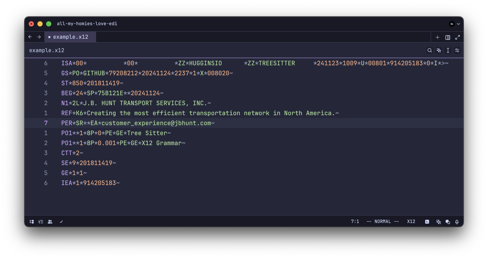

# tree-sitter-x12

A [tree-sitter] grammar for EDI X12.

This grammar does not validate the content or structure of the EDI document. It's really just meant to enable basic highlighting support in your favorite text editors.

If you do need to validate the content and structure of an EDI document, I would highly recommend the [Stedi EDI Inspector].

## Preview

## Editors

The following editors support EDI X12 using this grammar:

- [Zed](https://zed.dev) via [hugginsio/zed-edi](https://github.com/hugginsio/zed-edi)

## Legal

"X12" is a trademark of X12 Incorporated. The `tree-sitter-x12` grammar is not endorsed by, sponsored by, or affiliated with X12 Incorporated or ASC X12. My use of these names (and brands) is for identification purposes only, and does not imply any such endorsement, sponsorship, or affiliation.

<!-- Links -->

[tree-sitter]: https://github.com/tree-sitter/tree-sitter
[Stedi EDI Inspector]: https://www.stedi.com/edi/inspector
